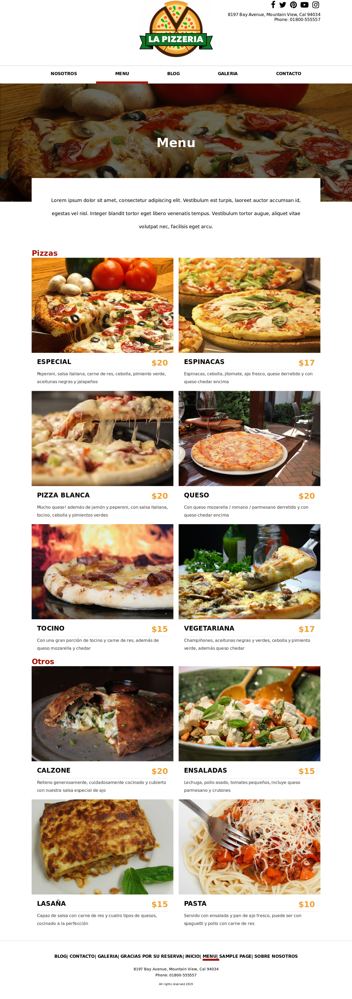

WordPress Theme: Pizzeria
==================

Este fue un tema de WordPress para pizzerías y restaurantes, que hice como partede una práctica, dispone de manejo de reservaciones sin nececidad de instalar un plugin adicional.

Para instalarlo se deben seguir los siguientes pasos:

~~~
1) Haz clic en el enlace del instalador llamado “Subir”
2) Elegir el archivo pizzeria.zip y hacer clic en el botón llamado “Instalar ahora“.
3) Al subir el tema tendrás las opciones normales de la instalación de un tema de WordPress y se previsualizar antes de activarlo.
~~~
 

